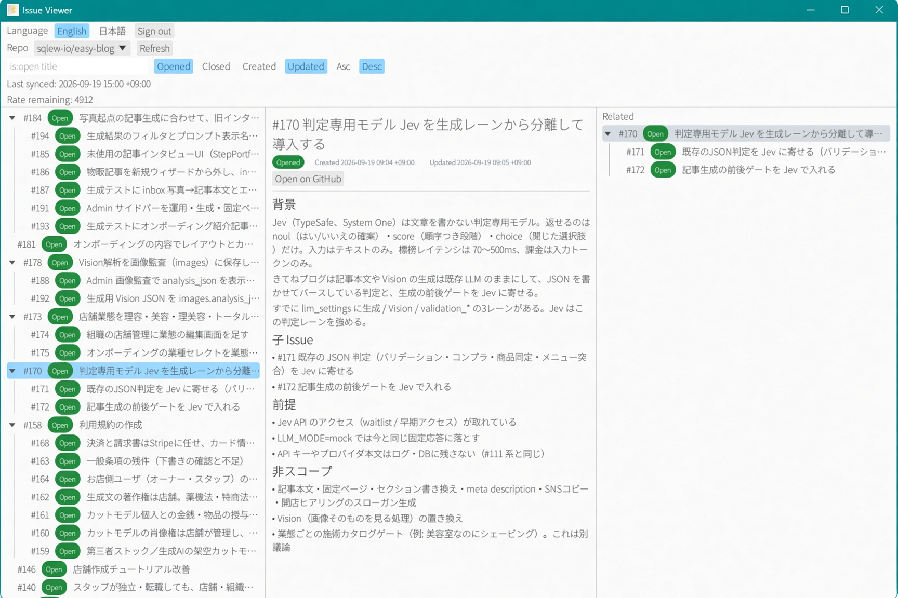

# Nested GitHub Issue Viewer



Desktop viewer for GitHub sub-issues. Nested parent/child comes from GitHub's own sub-issue links, cached in local SQLite. Issues do not need to be in a GitHub Project.

See [SPEC.md](SPEC.md).

## Features

- Sign in with GitHub OAuth Device Flow (session kept until Sign out)
- Restore last repository, issue, window size, and pane widths
- Three panes: issue tree, markdown body, related parent/child
- Filter/sort (`is:open`, Open/Closed, created/updated)
- English and Japanese UI
- Bundled Noto Sans JP (SIL Open Font License)

Read-only: the app does not create, edit, or close issues.

## Install

Download the latest build from this repository’s **Releases** page.

| File | Platform |
|------|----------|
| `issue-viewer-windows-x64.exe` | Windows |
| `issue-viewer-macos-arm64` | macOS (Apple silicon) |
| `issue-viewer-linux-x64` | Linux |

Run the binary. Sign in with GitHub when asked. The OAuth Client ID is already compiled in — you do not create an OAuth App.

Windows may warn on an unsigned download (SmartScreen). Use **More info** → **Run anyway**.

Linux needs the usual desktop libraries (GTK 3 / X11). If the binary fails to start, install your distro’s `libgtk-3` package.

## Data

- Access token: OS keyring (`issue-viewer` / `github`), never stored in SQLite. Survives app restarts until **Sign out**.
- Last selected repository and issue, plus window/pane layout: SQLite under the user data directory (`issue-viewer`)
- Issue cache: `cache.sqlite` in that same directory

## Font

`assets/fonts/NotoSansJP-Regular.ttf` is Noto Sans JP, SIL OFL.

## Development

```bash
cargo test
cargo run --release
```

Tagged `v*` pushes build the three binaries and publish a GitHub Release (see `.github/workflows/release.yml`).

To change the compiled OAuth App, edit `src/config.rs` (`GITHUB_CLIENT_ID`). Create an OAuth App at https://github.com/settings/applications/new, enable **Device Flow**, request the `repo` scope.
